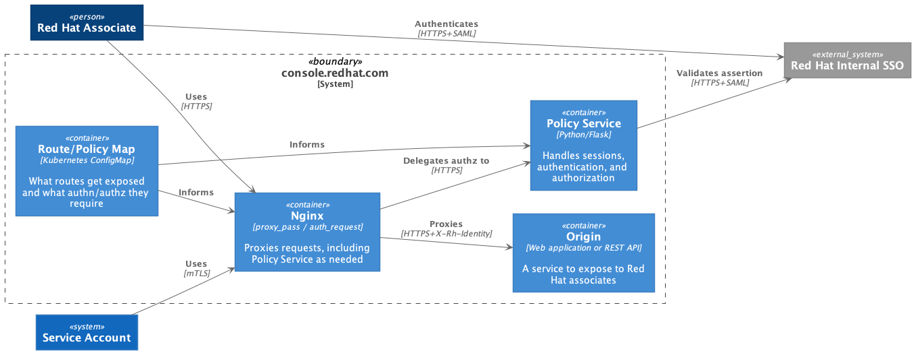
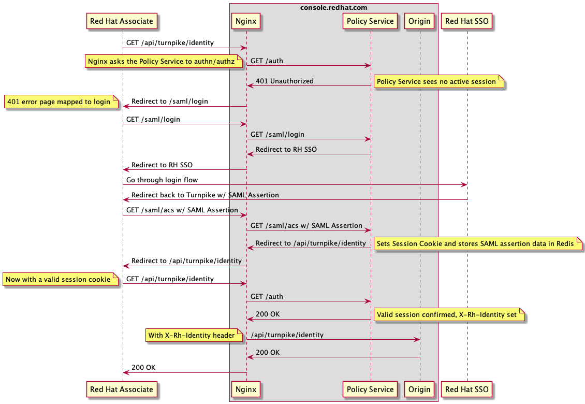
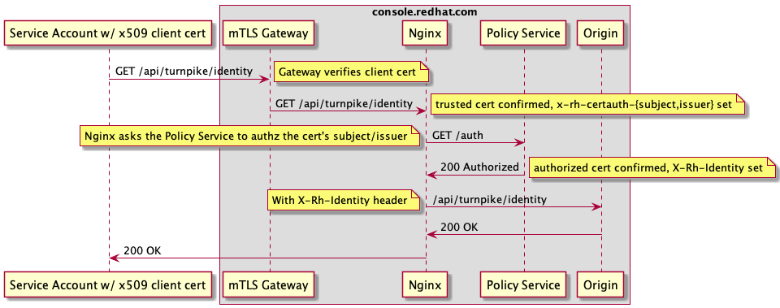

The Turnpike Web Gateway offers protected access to hosted web applications and API services using SAML authentication
and attribute-based access control. It uses the Nginx web server, a Python/Flask policy server, and a Redis database.

When to use Turnpike
--------------------

If you are developing an application or service on the Cloud Services Platform that has views or APIs that are not
meant for customer consumption, you probably want to expose them through Turnpike. Examples of use cases include:

* Administrative or monitoring interfaces to your cloud.redhat.com-hosted application or service
* Exposing platform-hosted data to trusted applications running behind the Red Hat firewall
* Enabling support interfaces to your application or service

If what you're building is meant to be accessed by customers or customer-managed infrastructure, the 3Scale API Gateway
is the proper place to go. If what you are building has components not meant for customer use or access, Turnpike is an
appropriate place to route through.

How it works
------------

Turnpike makes use of the [auth_request][auth_request] feature of Nginx, which delegates authentication/authorization
to a web service. The web service itself is a [Flask][flask] application that implements a SAML Service Provider and
allows/denies specific requests to routed web applications & APIs based on the attributes of the SAML assertion. Session
data is stored in Redis to better manage content and expiry.

A successful SAML user request workflow looks like:

A successful mTLS request workflow looks like:

Route map and Attribute based access control
--------------------------------------------

Turnpike is configured using a route map that lists what URLs to expose, what upstream URLs to reverse proxy them to,
and what authentication/authorization requirements it should enforce. For example:

    - name: turnpike
      route: /api/turnpike
      origin: http://web:5000/api/turnpike
      auth:
        saml: "True"
    - name: healthcheck
      route: /public/healthcheck
      origin: http://web:5000/_healthcheck

The map is a list of routes. Each route has three required fields: a `name` which must be a unique string, a `route`
which represents a URL prefix substring to match for this route, and an `origin` which represents the URL to proxy to.
The substring matching of `route` and the rewriting to `origin` are the same as the Nginx location matching and rewrite
rules.

If a route has a key `auth`, then it will require authentication. The `auth` key's value should be a set of key/value
pairs representing supported authentication schemes and corresponding authorization rules. At this time, the only
supported authentication schemes are `saml`, `x509`.

The value associated with `saml` should be a Python expression that evaluates to `True` or `False`. The only variable
in the expression is a dictionary `user` which contains the SAML assertion for the requesting user. If the assertion
had multiple `AttributeValue`s for a single `Attribute`, then those values are represented as a list of values.

> Note: The Red Hat SSO SAML assertion will return LDAP roles which Turnpike makes available to your predicates via:
`user['Role']`. Production SSO will return your production LDAP groups, configured at https://rover.redhat.com/groups/ while
Stage and other non-prod environments will return groups configured at: https://rover.stage.redhat.com/groups/. 
If you create a new role for cloud.dot purposes, it is a good idea to prefix it with ' crc-'.

So for example, if you wanted to limit access to a route to users who had the role `admin`, `auditor`, or `manager`,
your Python expression could be:

    set(['admin', 'auditor', 'manager']).intersection(set(user['Role']))

The evaluation would use set-logic to look for overlaps. If there were any overlaps, the predicate would evaluate to
`True`. If not, `False`.

> Note: Presently the RHCSP Turnpike installation does terminate mTLS and thus does not report the necessary HTTP
  headers to enforce x.509 authn/authz requests. This is forthcoming.

`x509` also takes a Python expression which evaluates to `True` or `False`. It is passed a dictionary `x509` which
contains two attributes: `subject_dn` and `issuer_dn` which can be used to further restrict which certs can be used
(nginx already verifies the trust chain based on the configured CA file).

For example to restrict the endpoint to a certificate with the DN of `/CN=test`, you could use:

    x509['subject_dn'] == '/CN=test'

X-RH-Identity
-------------

Like services that are customer-facing, services routed by Turnpike present information about the authenticated
principal using the `X-RH-Identity` header, however whereas customer-facing services receive a header with a type of
`User` or `System`, Turnpike issued headers have a type of `Associate` for SAML authenticated users and of `X509` for
mTLS authenticated users.

These are best shared by example. For SAML authentication:

    {
      "identity": {
        // The associate section contains the Associate type principal data
        "associate": {
          // The Roles correspond to LDAP groups
          "Role": [
            "some-ldap-group",
            "another-ldap-group"
          ],
          "email": "jschmoe@redhat.com",
          "givenName": "Joseph",
          "rhatUUID": "01234567-89ab-cdef-0123-456789abcdef",
          "surname": "Schmoe"
        },
        // In the future, Associates might be authenticated through other means
        "auth_type": "saml-auth",
        // The Associate type asserts that the request comes from an active Red Hat employee
        "type": "Associate"
      }
    }

Or alternatively, for mTLS:

    {
      "identity": {
        "x509": {
          // The subject presented by the client
          "subject_dn": "/CN=some-host.example.com",
          // All trusted CAs will have to be configured by the platform team at the edge
          "issuer_dn": "/CN=certificate-authority.example.com"
        },
        "auth_type": "X509",
        // The X509 type asserts that the request comes from a system with a trusted x.509 certificate
        "type": "X509"
      }
    }

If your application needs to vary its functionality based on the requesting user or if your application needs to
perform more granular access control, it will need to consume this header to do so.

Best practices when creating routes
-----------------------------------

When creating Turnpike routes, to promote harmonious co-existence, your Turnpike-exposed URLs must fit into the
following rules:

* If you're exposing an API for app `myapp`, your route should begin with `/api/myapp/` - these routes must require
  authentication.
* If you're exposing a web application with its own HTML interface for app `myapp`, your route should begin with
  `/app/myapp/` - these routes must require authentication.
* If you're exposing a route and really need it to require no authentication at all:
  * You probably should be exposing the route through 3scale. The Turnpike gateway is really for internal associates
    only.
  * But if you really, really have a good reason to still need it, your route must begin with `/public/`

In the future, we imagine having a common chrome for building user interfaces integated with Turnpike routed APIs.

All `origin` URLs must be services within the OpenShift cluster, however be sure in your exposed application or APIs
to be aware of URLs being returned to the user in HTML documents or API hypermedia, so that they conform to the URLs as
the user would perceive them.

If your origin route is to the root path of your service, your `route` and `origin` values must contain a trailing
slash. The forwarding mechanism uses Nginx's [proxy_pass][proxy_pass] directive, so an `origin` of a URL without a path
at the end will reuse the request path in the same form.

For security purposes, it's advisable to have a different service serving Turnpike routed views than the one serving
3scale routed views. If you choose that the service exposed via Turnpike be the same service you expose via 3scale, you
are _strongly_ encouraged to pick a completely different URL space in your service to differentiate Turnpike exposed
views from 3scale exposed views. For example, the RBAC service exposes its Turnpike routed views from the URL prefix
`/_private/` so as not to accidentally expose these views to the public.

For operational integrity purposes, it's advisable for destructive operations exposed through Turnpike routes to be
closely guarded and audited. For example, every request that writes to a database with customer data should be logged
with the user who requested it and the specific operations performed. Additionally, it's a good idea to require a
specific environment variable be set to a date-time in the future in order for destructive operations to be allowed;
that way, an app-interface Merge Request would be required to enable destructive operations, and the passage of time
would disable them automatically without a subsequent app-interface Merge Request.

How to create a new Turnpike Route
----------------------------------

The route map for Turnpike is managed in app-interface as a deployment parameter that feeds
into a `ConfigMap`. To create or modify a route for the RHCSP Turnpike installation, you'll
have to modify it and create a Merge Request.

1. Start with stage. In the app-interface tree, edit the file at:
   `/data/services/insights/turnpike/deploy.yml`
   and add your route to the `BACKEND_ROUTES` parameter in the staging namespace.

2. Make sure you allow Turnpike access to your service's namespace. Modify your namespace file, which if your app's
   name is `myapp` should be at `/data/services/insights/myapp/namespaces/stage-myapp-stage.yml`. Under the
   `networkPoliciesAllow` key, add to the list `$ref: /services/insights/turnpike/namespaces/stage-turnpike-stage.yml`

3. Open a Merge Request. One of the Turnpike service owners will `/lgtm` your request.

4. If the merge request works, you should be able to see your route in action at `internal.cloud.stage.redhat.com`

5. If everything looks good, we can move to production. In the app-interface tree, edit the files as before at
   `/data/services/insights/turnpike/deploy.yml` (this time use the prod namespace at the bottom of the file) and
   `/data/services/insights/myapp/namespaces/prod-myapp-prod.yml` (but don't forget to allow the `prod-turnpike-prod`
   namespace instead of the `stage-turnpike-stage` one.)

6. Open a Merge Request. Again, a Turnpike service owner will `/lgtm` your request.

If the merge request works, you should be able to see your route in action at `internal.cloud.redhat.com`.

Reporting issues
----------------

If you have questions, reach out to the Platform Infrastructure team. To report issues, do so at the GitHub repository
for Turnpike: https://github.com/RedHatInsights/turnpike

[auth_request]: https://docs.nginx.com/nginx/admin-guide/security-controls/configuring-subrequest-authentication/
[flask]: https://flask.palletsprojects.com/en/1.1.x/
[proxy_pass]: https://nginx.org/en/docs/http/ngx_http_proxy_module.html#proxy_pass
